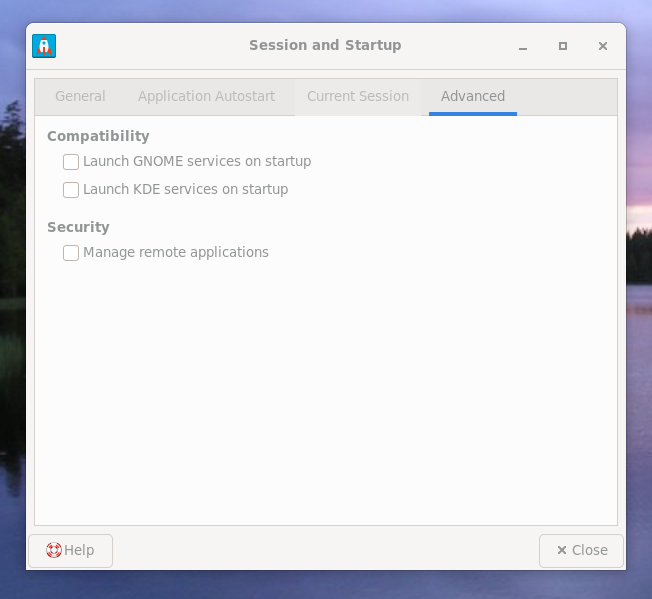

- Mageia
   - Session and Startup
      - Advanced
         - Launch GNOME services on startup



*/.config/xfce4/xfconf/xfce-perchannel-xml/xfce4-session.xml*

```xml
<property name="LaunchGNOME" type="bool" value="false"/>
```

